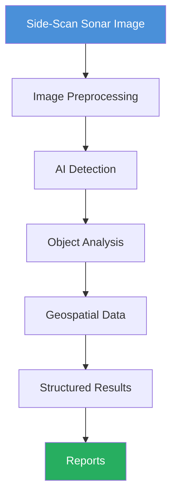
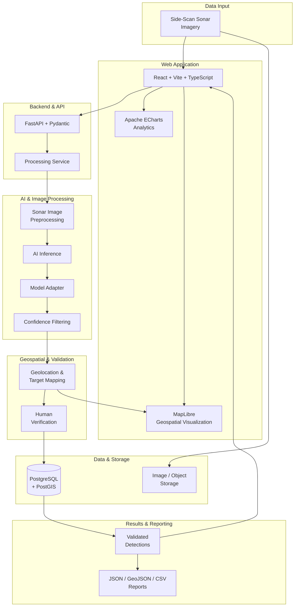

# NEZA AI - Neptune Environmental Zone Analytics AI

[](https://github.com/yourusername/neza-ai/actions/workflows/ci.yml)
[](https://opensource.org/licenses/MIT)

## >> Project Information

| Parameter | Details |
|---|---|
| **Hackathon** | Smart India Hackathon 2026 |
| **Problem Statement ID** | SIH26057 |
| **Problem Statement** | AI-Powered Automated Underwater Marine Debris and Anomaly Detection System using Side-Scan Sonar Imagery |
| **Team Name** | Marine Morph |
| **Category** | Software |

## >> Overview

**NEZA AI (Neptune Environmental Zone Analytics AI)** is an AI-powered
underwater environmental analytics system designed to analyze
Side-Scan Sonar (SSS) imagery and acoustic maps then identify marine debris and anomalous man-made objects present on the seabed.

The system Focuses to reduce the dependence on time-consuming and manual
inspection of sonar imagery which is often error prone, by providing an automated pipeline for
detecting and analyzing potential underwater anomalies.

NEZA AI focuses on converting raw sonar imagery into structured and
actionable information, including detected objects, confidence scores, shadow validation
and associated geographical information where available.

- Side-Scan Sonar surveys can generate large volumes of imagery that
require considerable time and expertise to inspect manually. Objects
such as marine debris, ghost nets, pipelines, and shipwrecks may be
difficult to distinguish from surrounding seabed structures.

> ***Note:***
> *NEZA AI addresses this challenge by combining image processing, AI-based detection, and geospatial analysis into a single workflow.*

## >> Problem Statement
Underwater marine surveys generate large amounts of Side-Scan Sonar
imagery that must often be inspected manually to identify debris,
infrastructure, and other anomalies.

Manual analysis can be:

- Time-consuming
- Labor-intensive
- Difficult to scale
- Dependent on operator expertise

NEZA AI aims to assist this process through automated AI-based analysisof Side-Scan Sonar imagery.

## >> Proposed Solution

NEZA AI processes Side-Scan Sonar imagery through a modular pipeline:


## >> System Architecture - Prototype Specific


## >> Key Features

### 1. Automated SSS Anomaly Intelligence 
NEZA AI transforms Side-Scan Sonar imagery from a manual inspection workflow into an automated anomaly-analysis pipeline. The system identifies potential underwater objects and distinguishes candidate targets from surrounding seabed regions using AI-driven visual analysis. 
The detection pipeline is designed to surface objects such as:
 - Ghost fishing nets /Chains 
  - Marine debris 
  - Pipelines 
  - Shipwrecks-
  -  Other anthropogenic seabed anomalies
 ---
### 2. Multi-Stage Sonar Image Intelligence Pipeline 
 Rather than performing direct inference on raw sonar imagery, NEZA AI uses a staged processing workflow in which sonar data is progressively prepared, analyzed, and transformed into structured detection results.
 ```mermaid 
flowchart TD
    A["1. Raw SSS Imagery"] --> B["2. Signal / Image Preprocessing"]
    B --> C["3. Feature Enhancement"]
    C --> D["4. AI-Based Object Detection"]
    D --> E["5. Object Segmentation"]
    E --> F["6. Detection Validation"]
    F --> G["7. Geospatial Association"]
    G --> H["8. Structured Intelligence"]   
```
---
### 3. AI-Assisted Object Localization and Segmentation
NEZA AI goes beyond identifying whether an anomaly exists. The computer-vision pipeline localizes detected targets within sonar imagery and supports segmentation of relevant regions.
This enables the system to retain spatial information about individual targets rather than reducing an entire sonar image to a single classification label.

Detection outputs can include:

-   Target class
-   Bounding region
-   Segmentation region
-   Confidence score
-   Source image/frame reference
---
### 4. Detection-to-Geolocation Transformation
Instead of treating an AI prediction as an isolated image coordinate, the system associates available geographical information with detected targets, enabling anomalies to be represented as spatial entities.
This allows detected underwater objects to be investigated not only through their sonar appearance but also through their geographical location.

---
### 5. Interactive Geospatial Intelligence Layer

NEZA AI incorporates **MapLibre** as the geospatial visualization  
engine for presenting detected underwater anomalies spatially.
The mapping interface is intended to provide an operational view of:
-   Detected anomaly locations
-   Spatial distribution of detections
-   Target-level geographical information
-   Survey areas and relevant map context

This creates a direct connection between AI-generated detections and  
their geographical interpretation.

---
### 6. Confidence-Aware Detection Results
Every AI-generated detection is paired by a confidence measure,  
allowing results to be interpreted according to the model's certainty  
rather than as binary decisions.

The confidence information can subsequently be used by the dashboard  
and reporting layers to:

-   Rank detected targets
-   Filter low-confidence detections
-   Compare detection categories
-   Support human review of uncertain results

NEZA AI therefore functions as an **AI-assisted analysis system** rather  
than treating every model prediction as a definitive conclusion.

##  >> Tech Stack

**Frontend :-**
    

**Backend :-**
   

**AI & Computer Vision :-**
 

**Database and Geotagging :-**
  

**DevOps and Version Control :-**
 

| Layer | Technology | Purpose |
|---|---|---|
| **Frontend** | React | Web-based user interface and dashboard |
| **Frontend** | TypeScript | Type-safe frontend development |
| **Frontend** | Vite | Frontend development and build tooling |
| **Geospatial Visualization** | MapLibre GL JS | Interactive detection and target mapping |
| **Data Visualization** | Apache ECharts | Detection analytics and visual dashboards |
| **Backend** | Python | Backend and AI processing |
| **Backend & API** | FastAPI | REST API and request handling |
| **Data Validation** | Pydantic | API schema and data validation |
| **Database ORM** | SQLAlchemy | Database interaction and ORM layer |
| **AI / Deep Learning** | PyTorch | AI model inference and deep-learning pipeline |
| **Computer Vision** | OpenCV | Sonar image preprocessing and image operations |
| **AI Integration** | Model Adapter | Modular interface for replaceable AI inference models |
| **Database** | PostgreSQL | Structured application and detection data |
| **Geospatial Database** | PostGIS | Storage and spatial handling of detection locations |
| **Geospatial ORM** | GeoAlchemy2 | PostGIS integration with SQLAlchemy |
| **Geospatial Data** | GeoJSON | Standardized representation of mapped detections |
| **File Storage** | Local Storage | Prototype storage for sonar imagery and generated files |
| **Reporting** | JSON | Structured detection and API reports |
| **Reporting** | CSV | Tabular detection and analysis reports |
| **Version Control** | Git & GitHub | Source-code version control and collaboration |

##  >>Limitations :-
The current NEZA AI implementation is a functional prototype focused on validating the core workflow from sonar image ingestion to AI-assisted detection, geospatial visualization, and structured reporting. The following limitations apply to the present prototype:

- **Prototype-Scale AI Models**  
  The current inference pipeline is designed with a modular model-adapter architecture and is not yet optimized around a fully trained, production-scale marine debris detection model.

- **Limited Sonar Input** 
  The prototype primarily operates on side-scan sonar imagery. Valid Realtime Data is yet not available as it is opensource 

- **Limited Geospatial Metadata Integration**  
  The current prototype does not directly ingest complete AUV navigation, GPS, ping, or survey telemetry streams. Geospatial target mapping is therefore limited by the metadata available with the processed imagery.

- **Prototype-Level Confidence Filtering**  
  Confidence-based filtering is implemented as a validation layer, but extensive model calibration and reliability evaluation across diverse marine environments remain future work.

- **Limited Dataset Coverage**  
  The prototype has not yet been validated against a large, diverse, and representative real-world marine debris dataset covering different seabed conditions, sonar configurations, and environmental conditions. Only On basic Training Data

- **No Real-Time Processing Pipeline**  
  The current implementation follows a prototype-oriented processing workflow and does not yet provide a production-grade real-time or continuous sonar processing pipeline.

- **Prototype Deployment Scale**  
  The current system is designed for demonstration and validation of the core architecture. Large-scale distributed processing, edge optimization, and production infrastructure are outside the scope of the present prototype.


> **Note:** These limitations define the scope of the current prototype and are not limitations of the overall NEZA AI vision. The architecture is intentionally modular to support the integration of more advanced models, real-time processing, expanded geospatial inputs, and production-scale deployment in future iterations.##  >> Current Limitations :-


##  >> Future Scope :-
The current prototype establishes the foundation for an intelligent sonar-based marine debris and underwater anomaly detection platform. Future development will focus on improving AI accuracy, operational scalability, geospatial intelligence, and deployment readiness.

- **Advanced AI Detection & Segmentation**  
  Integrate and evaluate more advanced object detection and segmentation models to improve the identification, localization, and delineation of marine debris and underwater anomalies.

- **Automated Anomaly Discovery**  
  Incorporate dedicated anomaly detection approaches to identify previously unseen or irregular underwater targets beyond predefined debris categories.

- **Large-Scale Dataset Development**  
  Expand training and validation datasets with diverse side-scan sonar imagery covering different seabed conditions, sonar configurations, environmental conditions, and debris types.

- **Real-Time Sonar Processing**  
  Develop a continuous processing pipeline capable of handling incoming sonar data with near-real-time detection, validation, and visualization.

- **AUV & Sonar Telemetry Integration**  
  Integrate AUV navigation data, GPS information, sonar logs, timestamps, and other available survey metadata to improve target geolocation and spatial accuracy.

- **Advanced Geospatial Intelligence**  
  Enhance spatial analysis through improved target localization, spatial clustering, detection density analysis, and geospatial decision-support capabilities.

- **AI Confidence & Reliability Calibration**  
  Introduce systematic confidence calibration and reliability analysis to improve threshold selection, reduce false positives, and provide more trustworthy detection results.

- **Edge AI Deployment**  
  Optimize inference models using technologies such as ONNX Runtime and OpenVINO for efficient deployment on resource-constrained or edge computing environments.

- **Scalable Processing Architecture**  
  Extend the prototype's synchronous processing workflow into a distributed architecture using background task processing and message queuing for large-scale sonar surveys.

- **Production-Scale Deployment**  
  Evolve the prototype into a scalable production system capable of supporting larger datasets, multiple concurrent surveys, distributed processing, and operational marine-debris monitoring.

- **Operational Decision Support**  
  Build higher-level analytical capabilities to assist marine survey teams with target prioritization, cleanup planning, and efficient underwater inspection workflows.

> **Long-Term Vision:** NEZA AI aims to evolve from a prototype sonar-image analysis system into an edge-ready, scalable marine intelligence platform capable of transforming large volumes of underwater survey data into actionable, geotagged marine-debris and anomaly intelligence.
##  >> Team :-

| Name | Role | Responsibilities |
|---|---|---|
| **Parth Muni** | Team Leader & Backend Developer | Project coordination, backend architecture, API development, database integration |
| **Ojas Mahajan** | AI/ML Developer | AI model development, sonar image processing, detection and segmentation |
| **Kushagr Chaturvedi** | Frontend Developer | React dashboard, data visualization, MapLibre-based geospatial interface |
| **Ayushi Joshi** | Full-Stack / GIS Developer | Geospatial processing, detection mapping, API integration and reporting |
| **Bhavya Kalla** | Research & Documentation | Research, testing, documentation and presentation |
| **Hirav Maru** | Testing & Deployment | System testing, integration, deployment and performance validation |
